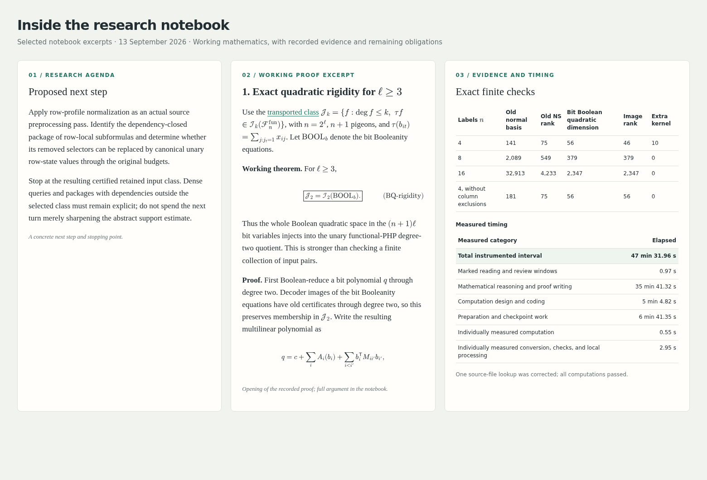

# A Self-Improving Framework for Autonomous Mathematical Research

An open framework for autonomous mathematical research—with persistent memory,
reproducible evidence, and a workflow that improves through use.

- **Research that survives session boundaries.** Resume from findings, proofs,
  and context stored in the repository, even on another machine.
- **Autonomous investigation.** Pursue a goal through repeated cycles of
  reasoning, experimentation, and review.
- **A workflow that improves through use.** Identify friction after each cycle
  and make bounded improvements to tools and procedures.
- **Inspectable results.** Preserve arguments, assumptions, computational
  evidence, and failed approaches with explicit claim statuses.
- **A live, versioned notebook.** Follow progress locally or online, with
  complete research checkpoints in Git.

**[Read the research online](https://kbr.is-a.dev/math-research/)** ·
**[Run the agent](#continue-the-research)** ·
[Browse locally](#browse-locally)

[](https://kbr.is-a.dev/math-research/)

*Selected excerpts from the 13 September 2026 notebook checkpoint, arranged
side by side.*

The framework combines an explicit research protocol for AI agents with tools
for context recovery, protected computation, evidence archival, and publication.
Self-improvement means refining the research workflow and its tools; mathematical
arguments remain open to review, and recorded proofs are not automatically
formally verified.

## First ongoing case study: proof-complexity lower bounds

The first application investigates superpolynomial proof-size lower bounds for
the ordinary pigeonhole principle in fixed-depth AC⁰[p]-Frege systems: bounded-depth
propositional proof systems with modular counting gates. **The goal remains open.**

**[Read the live research notebook](https://kbr.is-a.dev/math-research/).**
Its initial sections describe the current state, remaining obstacles, and proposed
next step. The research record preserves results, proofs, unsuccessful attempts,
and measured timing, making the ongoing investigation available for inspection.

The research began in Claude, continued in ChatGPT, and moved to Codex. The
[pre-handoff research compendium](php_codex_handoff/php_extension_research_compendium.pdf)
and historical manuscript preserve the earlier development.

## How a research cycle works

**Restore context → Choose an obstacle → Investigate → Check → Record →
Assess the process → Commit → Repeat**

Each cycle starts with a named unresolved obligation and a concrete stopping
point. The agent develops an argument or experiment, reviews the result, and
records what actually changed—even when the outcome is an obstruction or failed
attempt. It then assesses the process, completes the research checkpoint, and
commits any justified framework improvement separately before continuing.

The [Spin prompt](PROMPTS.md#spin) runs this loop under the
[research protocol](AGENTS.md). Corrections receive new dated entries; earlier
arguments remain available. See [Automatic research](#automatic-research) to
start the loop with a Codex goal.

## Tools behind the workflow

The agent follows the research protocol; the tools enforce specific execution
and evidence checks. The launcher integrates with Codex CLI, while the research
record uses ordinary HTML, Markdown, code, and data files.

| Task | Tools and records |
| --- | --- |
| Recover the right context | [Restart guide](research/notes/RESUME.md) and [validated section excerpts](tools/notebook-excerpt.py) avoid repeatedly loading the full history. |
| Find and reuse results | The [claim index](research/CLAIM_INDEX.md) links stable labels and claim statuses to complete statements and proofs. |
| Run and measure experiments | [compute.sh](compute.sh) combines resource controls, timeouts, complete output logs, and timing reports that count overlap once. |
| Preserve reproducible evidence | [Provenance manifests](tools/record-provenance.py) record file hashes; [session archival](tools/archive-session.py) preserves outputs and refuses conflicting replacements. |
| Finish a research checkpoint | [finish-turn.py](tools/finish-turn.py) exports timing, archives evidence, and inserts the notebook timing table before review and commit. |
| Publish the intended material | [Checkout/history checks](tools/verify-checkout.py) check known private-source exclusions; the [static builder](tools/build_pages.py) packages only public site files. |

## Read the research

The **[published notebook](https://kbr.is-a.dev/math-research/)** needs no setup
or agent account. Start with its living overview for the research agenda, then
follow claim links into the full record and supporting evidence.

### Browse locally

```bash
git clone https://github.com/kbr-/math-research.git
cd math-research
python3 server.py
```

Open **http://localhost:8000**. Editing [notebook.html](notebook.html) refreshes
its rendered mathematics automatically. MathJax loads from a CDN, so the browser
needs internet access. `index.html` supplies the layout and rendering logic.
Use `python3 server.py --port 8001` if the default port is occupied.

The [published notebook](https://kbr.is-a.dev/math-research/) is built by
GitHub Actions when relevant notebook or site-tooling changes are pushed to
`main`. It is a standalone site and requires no local server.

## Continue the research

To run the agent, clone the repository as above, install and authenticate Codex
CLI, and initialize the [computation controls](#computation-tools) before running
experiments. Browsing the notebook alone does not require those controls.

Research using this framework has only been tested with **GPT-6 Astra** at the
**Max** thinking setting.

[research/notes/RESUME.md](research/notes/RESUME.md) is the reading guide for
restoring research context. It points to the notebook's authoritative initial
sections and selected supporting sources. The original handoff import is complete;
resuming work does not require repeating it.

With Codex CLI installed and authenticated, run:

```bash
./start-codex.sh
```

On a fresh clone, the launcher starts a session that restores context from the
committed files. Subsequent launches resume the session recorded locally in
`.codex-session-id`. Use `--new` to start and bind a fresh session, or `--resume`
to require an existing binding. Session IDs, chat history, and authentication
are not included in the repository.

The launcher selects Vim for Ctrl+G and automatic approval review. Context and
auto-compaction budgets are editable constants at the top of `start-codex.sh`.
A Codex CLI version supporting these options is required.

[AGENTS.md](AGENTS.md) describes the research workflow: maintain the notebook's
living sections, append each research attempt with its timing and evidence,
and commit complete checkpoints locally. Publishing requires authorization under
the repository's Git policy; research work alone does not authorize a push.

### Automatic research

Use a Codex **goal** to keep the agent working across successive turns without
prompting it after every checkpoint. The goal points to the **Spin** prompt in
[`PROMPTS.md`](PROMPTS.md#spin), which defines the research, process-improvement, and checkpoint
loop, including how to resume after context compaction.

After restoring context in the session for your chosen checkout:

- **Codex CLI:** enter `/goal <objective>` in the interactive session.
- **ChatGPT app:** open the remotely connected Codex session for that checkout,
  enter `/goal`, and supply the same objective in the goal interface.

The ongoing research session on `main` uses the following goal, with the prompt
filename updated here to `PROMPTS.md`. Enter it with
`/goal` in the CLI, or paste the objective after `/goal` into the app's goal field:

```text
/goal Execute the "Spin" prompt in ./PROMPTS.md: autonomously advance the ordinary-PHP AC0[p]Frege lower-bound research through bounded, fully recorded research cycles and clear, small framework improvements. Follow the saved prompt and repository rules, maintain the notebook and measured evidence, commit checkpoints and push main as explicitly authorized, restore context and reread the prompt after compaction, and continue until the user explicitly interrupts.
```

This example includes the maintainer's explicit authorization to push `main`.
For another checkout or branch, adapt the objective and publication scope under
[the Git policy](AGENTS.md#portable-sessions-and-git-checkpoints). For local-only
work, replace the push clause with: "Override Spin's branch and publication
instructions: stay on the current branch, commit locally, and do not push."
The Spin prompt remains the authoritative loop; there is no need to paste its
full instructions into each goal.

In the CLI, `/goal` displays the current objective, `/goal edit` changes it,
`/goal pause` pauses it, `/goal resume` continues it, and `/goal clear` removes it.
The app also provides goal controls in its progress row. Keep the machine hosting
the remote session awake and connected while it works. See the official OpenAI
guides to [long-running work](https://learn.chatgpt.com/docs/long-running-work)
and [goal commands](https://learn.chatgpt.com/docs/developer-commands?surface=cli#set-or-view-a-task-goal-with-goal).

## Computation tools

Python 3.10+ is required for the complete toolset. The notebook server,
resource controller, and timing tools use the Python standard library.
[requirements-research.txt](requirements-research.txt) records numerical-library
versions used in the research environment; historical suite A01 also requires
Numba. Dependency installation by an agent requires explicit approval under
[COMPUTATION_RULES.md](COMPUTATION_RULES.md).

The protected computation launcher requires **Linux, cgroup v2, a user systemd
manager, and a C compiler**. Its resource profile uses CPUs 0–13 and a shared
10 GB combined RAM-plus-swap budget, with no fixed RAM/swap split. See
[resource-controls/README.md](resource-controls/README.md) for compatibility and
enforcement details. Unsupported controls fail closed.

Initialize the controls from the checkout root after reboot or login:

```bash
python3 resource-controls/setup.py
./compute.sh --status
```

Setup rebuilds runtime controls from source and installs no packages. Run
computations through `./compute.sh`; it combines resource enforcement, timing,
and full output logging. For example, with a research script `calculation.py`:

```bash
./compute.sh start turn001
./compute.sh phase turn001 reading
./compute.sh run turn001 --threads 1 -- python3 calculation.py
# After drafting the notebook entry with <!-- TIMING turn001 -->:
./tools/finish-turn.py turn001
```

The finalizer exports timing, archives evidence under the resource limits, and
fills the unique notebook placeholder. `--next turn002` also starts the next
cycle's clock immediately after the snapshot. Review and commit the checkpoint
afterward. The lower-level timing commands remain in COMPUTATION_RULES.md.

Substantial result files belong in `research/results/`, with their generating
commands and verification evidence. Completed timing sessions are archived in
`research/provenance/`; operational logs and scratch files are ignored.

Build a local static notebook artifact with:

```bash
./compute.sh --threads 1 python3 tools/build_pages.py --out _site
```

The generated `_site/` directory contains only the rendered page and revision
metadata. It is ignored by Git.

## Repository contents

- `publications/drafts/`: review manuscripts with editable TeX and rendered PDFs,
  including the [bit-PHP resolution-over-parities draft](publications/drafts/bit-php-resolution-over-parities/).
- `PROMPTS.md`: reusable Dump, Resume, and Spin prompts.
- `notebook.html`: authoritative current state, working mathematical context,
  and append-only research record.
- `research/notes/`: restart navigation, proofs, source audits, historical import
  snapshots, and supporting research log.
- `research/results/`: complete computation outputs and timing tables.
- `research/references/`: bibliography, source audits, and papers cleared for
  redistribution. The [reference guide](research/references/README.md) lists
  availability and licensing.
- `research/provenance/`: durable timing, execution evidence, and resource tests.
- `resource-controls/`, `tools/`, `compute.sh`: reproducible execution and setup code.
- `php_codex_handoff/`: the unchanged historical package, including the manuscript,
  original TeX, eleven check archives, and reports, plus the ChatGPT-generated
  [pre-handoff compendium](php_codex_handoff/php_extension_research_compendium.pdf).

Verify historical-file integrity, the licensed source PDF, and essential tools:

```bash
./compute.sh --threads 1 python3 tools/verify-checkout.py
```

Runtime binaries, virtual environments, temporary renders, operational logs,
credentials, and local session state are excluded from version control.

## License and credit

Original software is MIT-licensed; original research writing and other covered
non-software material use CC BY 4.0. Forks and further research are welcome.
Preserve the applicable attribution notices and cite the results or tools your
research relies on. See [LICENSE](LICENSE), [ATTRIBUTION.md](ATTRIBUTION.md), and
[CITATION.cff](CITATION.cff). Mathematical facts and ideas are not claimed as
copyright property; scholarly attribution remains an ethical expectation.

Third-party materials retain their own rights. See
[THIRD_PARTY_NOTICES.md](THIRD_PARTY_NOTICES.md) for source licensing and
redistribution details.
